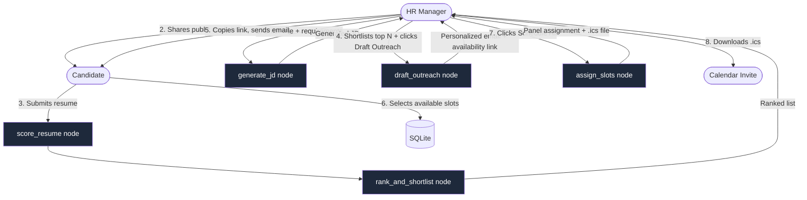
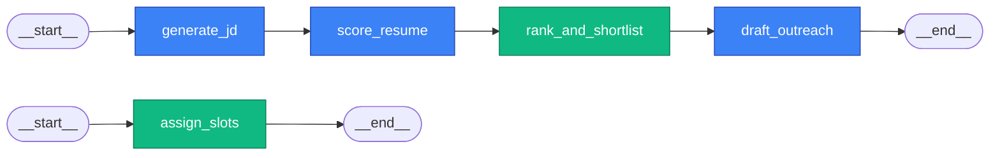
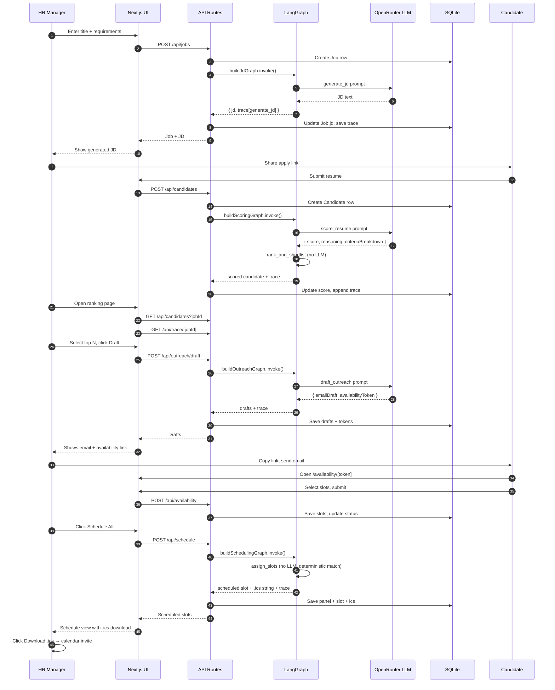

# AI HR Agent — Flow Diagram & Internals

## TL;DR

The agent replaces **three human HR roles** — Screener, Outreacher, Scheduler — all reporting to an HR Manager. It runs as **5 LangGraph nodes** composed into **4 triggerable subgraphs**, each firing at a different stage of the hiring funnel.

```
HR Input → [Agent runs] → Real Output (ranked shortlist, drafted email, .ics file)
```

No human writes a JD, scores a resume, drafts outreach, or picks interview slots.

---

## Who the Agent Replaces

| Human Role | What they do today | Agent node that replaces them |
|---|---|---|
| **HR Manager (not replaced)** | Approves at each stage, defines the requirement | Only interacts via buttons |
| **Screener** | Reads resumes, compares to JD, ranks candidates | `score_resume` + `rank_and_shortlist` |
| **Outreacher** | Writes personalized emails asking for interview availability | `draft_outreach` |
| **Scheduler** | Matches candidate slots to panel calendars, sends invites | `assign_slots` + `.ics` generator |
| **Sourcer** | *Not replaced* — candidates apply themselves via public form | — |

---

## High-Level Flow



---

## LangGraph Node Pipeline

The agent is a **5-node StateGraph** built with `@langchain/langgraph`. State flows left to right, and each node writes its observations into a shared `trace` array that powers the live observability sidebar.



- **Blue nodes** → call the LLM (OpenRouter → GPT-4o-mini)
- **Green nodes** → deterministic TypeScript logic (no LLM)

---

## 4 Composable Subgraphs

Instead of one monolithic graph, we compose **4 subgraphs** triggered independently by the UI. This keeps each API call fast and the state small.

| Subgraph | Triggered by UI | Nodes | Average runtime |
|---|---|---|---|
| **`buildJdGraph`** | HR submits New Job form | `generate_jd` | ~2s |
| **`buildScoringGraph`** | Candidate submits application | `score_resume` → `rank_and_shortlist` | ~3s per candidate |
| **`buildOutreachGraph`** | HR clicks "Draft Outreach" | `draft_outreach` | ~2s per candidate |
| **`buildSchedulingGraph`** | HR clicks "Schedule All" | `assign_slots` | ~50ms (no LLM) |

All 4 graphs share the same `HRAgentAnnotation` state shape — see `lib/agent/state.ts`.

---

## Node-by-Node: What the Agent Actually Does

### 1. `generate_jd` — Writes the Job Description
**Input:** Job title + raw requirements (one-liner from HR)
**Output:** Full structured JD with About, Responsibilities, Requirements, Nice to Have
**LLM call:** Yes — one prompt, temperature 0.3

**Prompt strategy:** Few-shot instruction with explicit section headers. Forces the LLM to produce 4 distinct sections rather than a wall of text. Does not include salary or location (HR fills those separately).

### 2. `score_resume` — Screens Each Candidate
**Input:** JD + candidate resume (full text)
**Output:** `{ score: 0-100, reasoning, criteriaBreakdown: [{criterion, score, comment}, ...] }`
**LLM call:** Yes — one prompt per candidate, JSON mode via strict prompt

**Prompt strategy:** Asks the LLM to extract 4 evaluation criteria *from the JD itself*, then score each independently. Returns strict JSON (stripped of markdown fences). Failure fallback: assigns score 50 with "manual review required" message so the pipeline never crashes mid-demo.

### 3. `rank_and_shortlist` — Picks the Top N
**Input:** Array of scored candidates
**Output:** Sorted list, top 5 above score threshold 70 marked `shortlisted`
**LLM call:** No — pure TypeScript

**Why no LLM here?** The ranking logic is deterministic (sort by score, filter threshold, cap at 5). Adding LLM here would add latency without signal gain. This is a good instinct for any agent: don't call the LLM when math is enough.

### 4. `draft_outreach` — Writes Personalized Emails
**Input:** Shortlisted candidates + JD
**Output:** Per-candidate email draft + unique `availabilityToken` (UUID)
**LLM call:** Yes — one prompt per shortlisted candidate

**Prompt strategy:** Constraints applied — under 120 words, warm tone, role-specific, ends with `[AVAILABILITY_LINK]` placeholder that the client replaces with the real URL (`/availability/[token]`). The token is the scheduler's lookup key for the candidate's later response.

### 5. `assign_slots` — Matches Availability → Panel
**Input:** Candidate availability slots + hardcoded panel member calendars
**Output:** `{ candidateId, panelMember, slot, icsFile }` per candidate
**LLM call:** No — pure TypeScript

**Matching algorithm:**
1. For each candidate, iterate their available slots in order
2. For each slot, find a panel member with matching availability not yet booked
3. Book first match; generate RFC 5545 `.ics` file as a string
4. If no overlap exists (edge case), fall back to panel member #1 at their next open slot

The `.ics` file is a real calendar invite the HR Manager can open in Google Calendar, Outlook, Apple Calendar, etc. Zero API keys needed.

---

## Observability — The Agent Trace

Every node emits an `AgentTraceNode` record to the shared state:

```typescript
{
  nodeName: "score_resume",
  inputSummary: "3 candidates scored against JD",
  outputSummary: "Scores: Vikram=94, Arjun=88, Neha=62 | Avg: 81",
  durationMs: 2847
}
```

These records are:
- **Appended cumulatively** to `AgentTrace.nodes` in SQLite (JSON column, per job)
- **Fetched by the ranking page** via `GET /api/trace/[jobId]`
- **Rendered as a sticky vertical timeline** on the right side of the rankings page

This makes the agent **auditable** — the HR Manager can see exactly which nodes ran, in what order, how long they took, and a summary of each decision. This is the difference between "black-box AI" and "employee you can audit."

---

## State Shape

One shared annotation, used by all 4 subgraphs:

```typescript
HRAgentState {
  jobId: string
  jobTitle: string
  requirements: string
  jd: string
  candidates: ScoredCandidate[]
  shortlist: ScoredCandidate[]
  outreachDrafts: OutreachDraft[]
  availabilityResponses: AvailabilityResponse[]
  scheduledSlots: ScheduledSlot[]
  trace: AgentTraceNode[]       // append-only via reducer
}
```

Every field except `trace` uses a **"last write wins"** reducer. `trace` uses an **append reducer** so each node contributes to the cumulative log across multiple subgraph invocations.

---

## Full Sequence Diagram — One Candidate End-to-End



---

## What Was Deliberately Faked

Per L3 scope rules — these are intentionally not real, and that is the correct 4-hour choice:

- **Panel calendar sync** — hardcoded `PANEL_MEMBERS` array in `lib/agent/panelData.ts`
- **LinkedIn / GitHub parsing** — stored as URL strings only
- **Candidate reply polling** — replaced with public availability form using UUID tokens

## What Is Genuinely Real

- **LLM reasoning on every scoring and drafting decision** — not templated
- **Persistent SQLite database** — survives restarts
- **Real email delivery via Resend** — clicking "Send Email" actually sends the drafted message and returns a Resend message ID; candidate receives the email in their inbox
- **`.ics` calendar file generation** — real RFC 5545 strings, open in any calendar app
- **LangGraph execution trace** — actual node timings and summaries, not fake data
- **Full candidate lifecycle** — applied → scored → shortlisted → outreach_sent → availability_received → scheduled

---

## File Map

```
lib/agent/
  state.ts              HRAgentAnnotation (shared state shape)
  graph.ts              4 compiled subgraphs
  llm.ts                OpenRouter ChatOpenAI factory
  panelData.ts          Hardcoded panel availability
  nodes/
    generateJd.ts       Node 1 — LLM
    scoreResume.ts      Node 2 — LLM
    rankAndShortlist.ts Node 3 — deterministic
    draftOutreach.ts    Node 4 — LLM
    assignSlots.ts      Node 5 — deterministic

lib/
  ics.ts                RFC 5545 .ics string generator
  prisma.ts             Prisma client singleton

app/api/
  jobs/                 POST/GET — triggers generate_jd
  candidates/           POST/GET — triggers score_resume + rank_and_shortlist
  candidates/[id]/      PATCH/GET — status updates
  outreach/draft/       POST — triggers draft_outreach
  availability/         POST — candidate submits slots
  availability/[token]/ GET — candidate lookup
  schedule/             POST/GET — triggers assign_slots
  trace/[jobId]/        GET — returns agent execution trace
```
